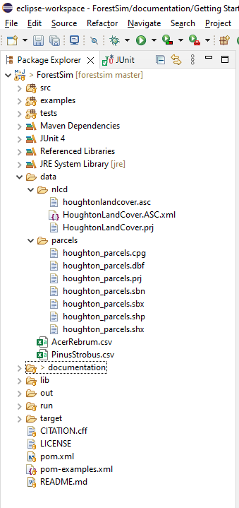
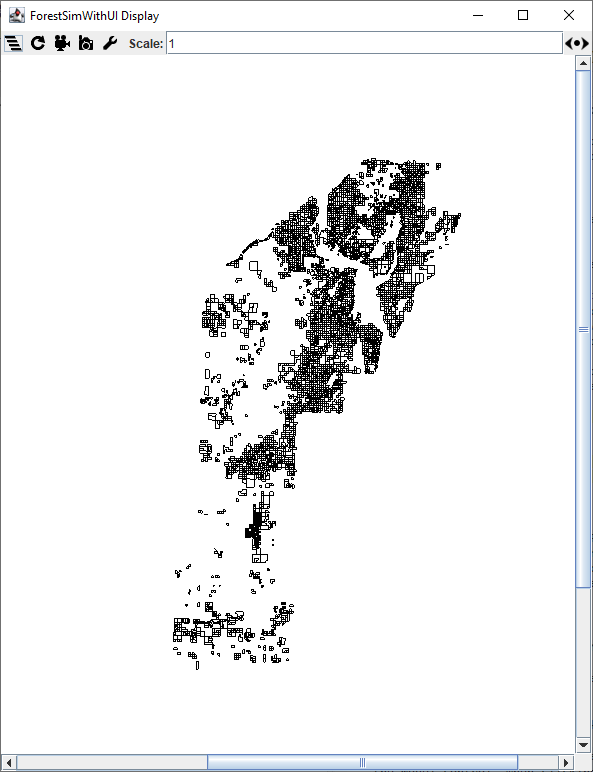
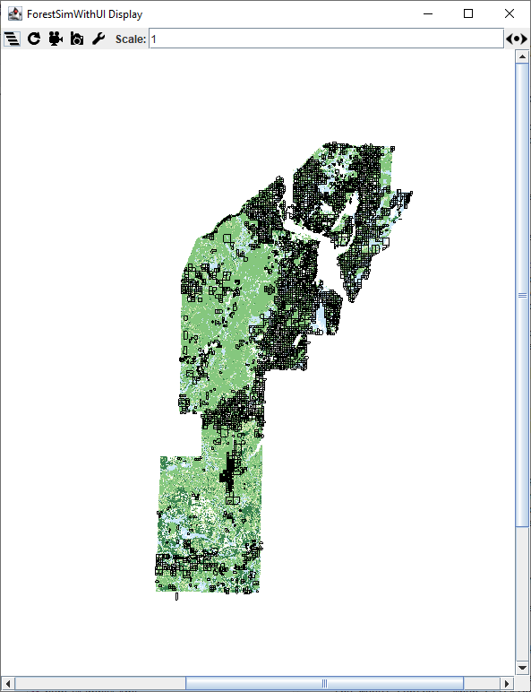
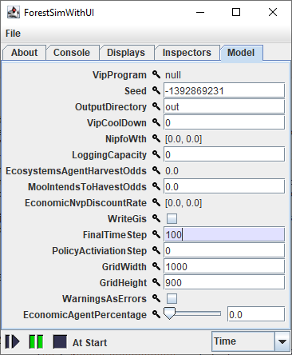

# Getting Started with ForestSim

This document serves as an introduction to using ForestSim for the first time. While familiarity with [MASON](https://cs.gmu.edu/~eclab/projects/mason/) is not assumed, it is encouraged that the [MASON user guide](https://cs.gmu.edu/~eclab/projects/mason/manual.pdf) (PDF) is read since ForestSim builds on the MASON environment, including the user interface. This document was prepared using Eclipse 2021-12 (4.22.0) and while older version of Eclipse are similar, some menu options may be different.

## Building ForestSim

The ForestSim environment can be downloaded from GitHub natively within Eclipse:

1. Select "File > Import" a new dialog will appear.
2. Expand the "Git" option and select "Projects from Git" and click "Next", the dialog will advance. 
3. Select "Clone URI" and click "Next", the dialog will advance.
4. Enter `https://github.com/forestsim-mtu/forestsim.git`  into the "URI" text box, the dialog will update, then click "Next".
5. Select "Next" when the "Branch Selection" dialog appears.
6. The directory you wish to download the repository to, or leave the default suggestion in place and click "Next".
7. Eclipse will work for a bit downloading the repository, once it is complete the option to "Import Existing Eclipse Projects" will appear, click "Next" and then "Finish".

Once complete, the ForestSim project will appear in the "Package Explorer" and Eclipse will start attempting to build the project. A red exclamation mark (!) may appear indicating that the project still needs to be configured. The first step is to ensure that the libraries supplied are registered with Eclipse and the build environment:

| JAR | Artifact ID | Group ID |
| --- | --- | --- |
| geomason-1.5.jar | GeoMason | GeoMason |
| mason-17.jar | Mason | Mason |
| quaqua-colorchooser-only.jar | quaqua-colorchooser-only | quaqua-colorchooser-only |

1. Expand the `lib` directory, you should see three or more JAR file listed.
2. Right click on one of the JAR files (ex., quaqua-colorchooser-only.jar) and select "Import", a new dialog will appear.
3. Expand "Maven" and select "Install or deploy an artifact to a Maven repository", then click "Next".
4. Enter the appropriate Artifact ID and Group ID based upon the JAR file and click "Finish".
5. The dialog will the close, repeat this process for each of the JAR files.
6. Once all JAR files have been imported, right click on `pom.xml` and select "Maven > Update Project" a new dialog will appear.
7. Ensure "ForestSim" is listed as a Maven project and click "OK", the project will be updated in the background and the red exclamation mark (!) should disappear.

## Running the Houghton County Demonstration Project

The ForestSim repository includes a simple demonstration project of Houghton County, Michigan, USA landcover and some parcel owners. This project can be used to explore the ForestSim UI and how a more complex project can be constructed. To run the demo you first need to unzip the `HoughtonData.zip` file to the root directory of the project into a new directory called `data`. Once complete your environment should look similar to the following with the files listed under the `data` directory:

With the files properly organized right click on the `examples` directory under the ForestSim project and click "Run As > Java Application". The first time you do this Eclipse will scan the directory, after which ForstSim will launch. You will be presented with two dialog windows: the display and the model control. When clicking on the pause button on the display (||) the button will turn green (||) and after a couple seconds, scattered boxes will appear in the display. These are the forested parcels and have agents assigned to them. 

By clicking on the "hamburger menu" in the upper left corner of the display, a menu appears with additional layers that can be displayed. Selecting "Land Cover" displays the [National Landcover Database](https://www.mrlc.gov/data/nlcd-2016-land-cover-conus) raster for the county. 

The "Stocking" option displays the current forest stocking where darker green indicates higher stocking and brown indicates lower stocking. The "DBH" option is for diameter at breast height (DBH) and darker indicates higher values. Finally, "Parcels Layer" is enabled by default and displays the parcels with agents attached to them. Note that only one raster layer may be displayed at a time, even if multiple are selected.

With the raster and agents now loaded, the simulation can be started. Since the demonstration doesn't set any specific values, most of the settings are left open ended and the default end time step for the simulation is zero. This prevents the demonstration from running. Since each time step represents one year, a value between 40 and 100, to allow for sufficient time for the forested landscape to change.

After changing the final time step the simulation can be started by clicking the "Pause" button again. The "Run" button will turn blue (▶) and the numbers next to the stop button (⬛) will start to increase until the end of the simulation when the stop button turns red (⬛) and the "Run" button reverts back to black. You will note that an `out` directory has been created under the ForestSim project, this contains various data files created during the model execution and any raster files created will be stored here as well.

